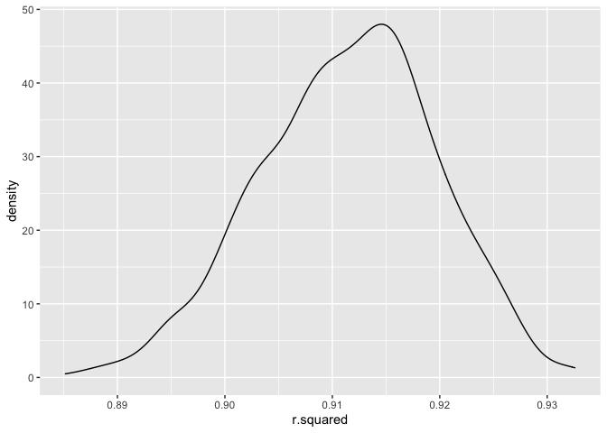
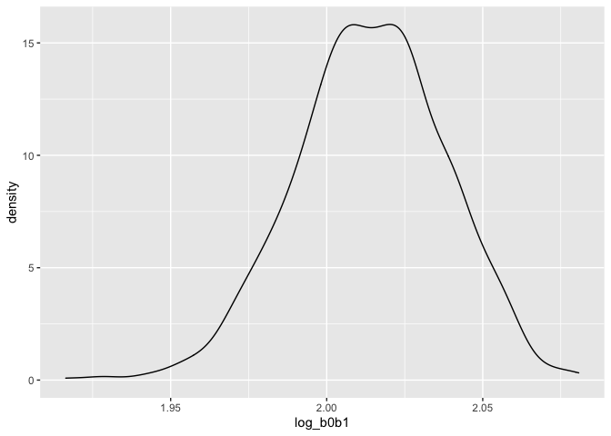
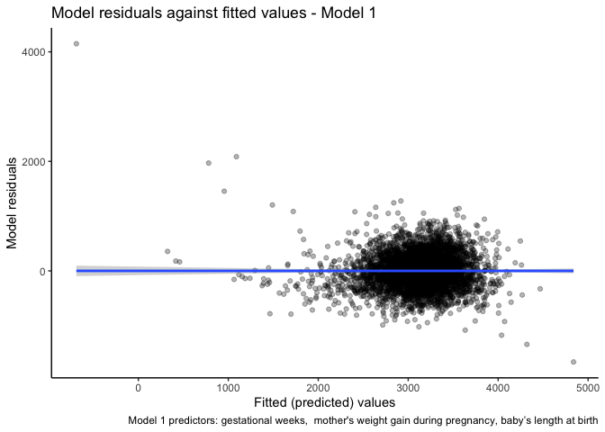
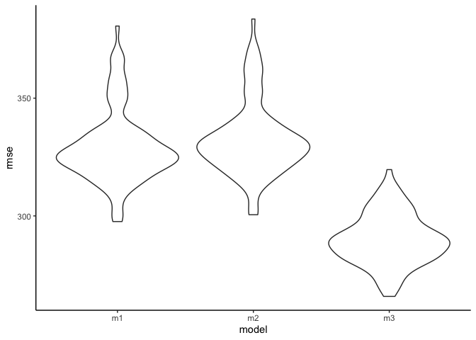
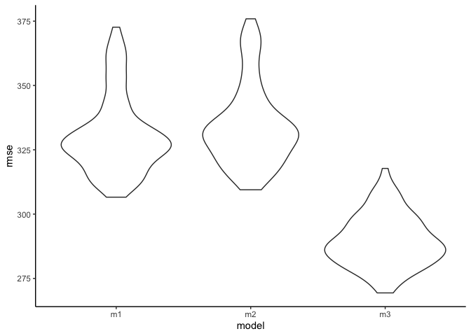

p8105_hw6_ay2543
================
Amy Yeung

# Problem 1

To obtain a distribution for $\hat{r}^2$, we’ll follow basically the
same procedure we used for regression coefficients: draw bootstrap
samples; the a model to each; extract the value I’m concerned with; and
summarize. Here, we’ll use `modelr::bootstrap` to draw the samples and
`broom::glance` to produce `r.squared` values.

``` r
weather_df = 
  rnoaa::meteo_pull_monitors(
    c("USW00094728"),
    var = c("PRCP", "TMIN", "TMAX"), 
    date_min = "2017-01-01",
    date_max = "2017-12-31") %>%
  mutate(
    name = recode(id, USW00094728 = "CentralPark_NY"),
    tmin = tmin / 10,
    tmax = tmax / 10) %>%
  select(name, id, everything())
```

    ## Registered S3 method overwritten by 'hoardr':
    ##   method           from
    ##   print.cache_info httr

    ## using cached file: ~/Library/Caches/R/noaa_ghcnd/USW00094728.dly

    ## date created (size, mb): 2022-09-29 10:37:42 (8.401)

    ## file min/max dates: 1869-01-01 / 2022-09-30

``` r
weather_df %>% 
  modelr::bootstrap(n = 1000) %>% 
  mutate(
    models = map(strap, ~lm(tmax ~ tmin, data = .x) ),
    results = map(models, broom::glance)) %>% 
  select(-strap, -models) %>% 
  unnest(results) %>% 
  ggplot(aes(x = r.squared)) + geom_density()
```

<!-- -->

In this example, the $\hat{r}^2$ value is high, and the upper bound at 1
may be a cause for the generally skewed shape of the distribution. If we
wanted to construct a confidence interval for $R^2$, we could take the
2.5% and 97.5% quantiles of the estimates across bootstrap samples.
However, because the shape isn’t symmetric, using the mean +/- 1.96
times the standard error probably wouldn’t work well.

We can produce a distribution for $\log(\beta_0 * \beta1)$ using a
similar approach, with a bit more wrangling before we make our plot.

``` r
weather_df %>% 
  modelr::bootstrap(n = 1000) %>% 
  mutate(
    models = map(strap, ~lm(tmax ~ tmin, data = .x) ),
    results = map(models, broom::tidy)) %>% 
  select(-strap, -models) %>% 
  unnest(results) %>% 
  select(id = `.id`, term, estimate) %>% 
  pivot_wider(
    names_from = term, 
    values_from = estimate) %>% 
  rename(beta0 = `(Intercept)`, beta1 = tmin) %>% 
  mutate(log_b0b1 = log(beta0 * beta1)) %>% 
  ggplot(aes(x = log_b0b1)) + geom_density()
```

<!-- -->

As with $r^2$, this distribution is somewhat skewed and has some
outliers.

The point of this is not to say you should always use the bootstrap –
it’s possible to establish “large sample” distributions for strange
parameters / values / summaries in a lot of cases, and those are great
to have. But it is helpful to know that there’s a way to do inference
even in tough cases.

# Problem 2

Loaded homicide data and cleaned it: \* created a `city_state` variable
\* added a variable to binarize whether the homicide has been solved or
not \* substituded unknown `victim_sex` entries as NA \* converted
`victim_age` into a numeric variable \* removed Dallas, TX, Phoenix, AZ,
Kansas City, MO, Tulsa, AZ \* filtered for white or black victim races
only

``` r
# Load data
homicide = read_csv("homicide-data.csv")
```

    ## Rows: 52179 Columns: 12
    ## ── Column specification ────────────────────────────────────────────────────────
    ## Delimiter: ","
    ## chr (9): uid, victim_last, victim_first, victim_race, victim_age, victim_sex...
    ## dbl (3): reported_date, lat, lon
    ## 
    ## ℹ Use `spec()` to retrieve the full column specification for this data.
    ## ℹ Specify the column types or set `show_col_types = FALSE` to quiet this message.

``` r
# Clean data
homicide = homicide %>% 
  mutate(
    city_state = str_c(city, ", ", state),
    solved = ifelse(disposition == "Closed by arrest", 1, 0),
    victim_sex = ifelse(victim_sex == "Unknown", NA, victim_sex),
    victim_age = as.numeric(victim_age)
  ) %>% 
  filter(
    !city_state %in% c("Dallas, TX", "Phoenix, AZ", "Kansas City, MO", "Tulsa, AL") &
    victim_race %in% c("White", "Black")
  )
```

    ## Warning in mask$eval_all_mutate(quo): NAs introduced by coercion

Used `glm` to fit a logistic regression with resolved vs unresolved as
the outcome and victim age, sex and race as predictors, then reported
the adjusted odds ratio and confudence interval for solving homicides
comparing male victims to female victims keeping all other variables
fixed.

``` r
# Fit logistic regression model for Baltimore, MD only
fit_baltimore = homicide %>% 
  filter(city_state == "Baltimore, MD") %>% 
  glm(solved ~ victim_age + victim_sex + victim_race, data = ., family = binomial())

baltimore_odds = fit_baltimore %>% 
  broom::tidy() %>% 
  mutate(OR = exp(estimate)) %>%
  select(term, log_OR = estimate, OR, p.value) %>% 
  mutate(ci.low = exp(confint(fit_baltimore))[,1],
         ci.high = exp(confint(fit_baltimore))[,2]) 
```

    ## Waiting for profiling to be done...
    ## Waiting for profiling to be done...

``` r
baltimore_odds
```

    ## # A tibble: 4 × 6
    ##   term               log_OR    OR  p.value ci.low ci.high
    ##   <chr>               <dbl> <dbl>    <dbl>  <dbl>   <dbl>
    ## 1 (Intercept)       0.310   1.36  7.04e- 2  0.976   1.91 
    ## 2 victim_age       -0.00673 0.993 4.30e- 2  0.987   1.00 
    ## 3 victim_sexMale   -0.854   0.426 6.26e-10  0.324   0.558
    ## 4 victim_raceWhite  0.842   2.32  1.45e- 6  1.65    3.28

``` r
baltimore_odds %>% 
  filter(term == "victim_sexMale") %>% 
  select(term, OR, ci.low, ci.high) %>% 
  knitr::kable(digits = 3)
```

| term           |    OR | ci.low | ci.high |
|:---------------|------:|-------:|--------:|
| victim_sexMale | 0.426 |  0.324 |   0.558 |

The adjusted odds ratio for solving homicides comparing male victims to
female victims holding age and race fixed is **0.426 (0.324, 0.558)**.

Ran glm for each of the cities in the dataset, and extracted the
adjusted odds ratio (and CI) for solving homicides comparing male
victims to female victims.

``` r
city_odds = homicide %>% 
  nest(data = -city_state) %>% 
  mutate(
  glm = purrr::map(.x = data, ~glm(solved ~ victim_age + victim_sex + victim_race, data = .x, family = binomial())),
  glm_tidy = purrr::map(glm, broom::tidy)
  ) %>% 
  unnest(cols = glm_tidy) %>% 
  filter(term == "victim_sexMale") %>% 
  mutate(
      OR = exp(estimate),
      ci.low = exp(estimate - 1.96*std.error),
      ci.high = exp(estimate + 1.96*std.error)
    ) %>% 
  select(city_state, OR, ci.low, ci.high)
  

city_odds %>% knitr::kable(digits = 3)
```

| city_state         |    OR | ci.low | ci.high |
|:-------------------|------:|-------:|--------:|
| Albuquerque, NM    | 1.767 |  0.831 |   3.761 |
| Atlanta, GA        | 1.000 |  0.684 |   1.463 |
| Baltimore, MD      | 0.426 |  0.325 |   0.558 |
| Baton Rouge, LA    | 0.381 |  0.209 |   0.695 |
| Birmingham, AL     | 0.870 |  0.574 |   1.318 |
| Boston, MA         | 0.667 |  0.354 |   1.260 |
| Buffalo, NY        | 0.521 |  0.290 |   0.935 |
| Charlotte, NC      | 0.884 |  0.557 |   1.403 |
| Chicago, IL        | 0.410 |  0.336 |   0.501 |
| Cincinnati, OH     | 0.400 |  0.236 |   0.677 |
| Columbus, OH       | 0.532 |  0.378 |   0.750 |
| Denver, CO         | 0.479 |  0.236 |   0.971 |
| Detroit, MI        | 0.582 |  0.462 |   0.734 |
| Durham, NC         | 0.812 |  0.392 |   1.683 |
| Fort Worth, TX     | 0.669 |  0.397 |   1.127 |
| Fresno, CA         | 1.335 |  0.580 |   3.071 |
| Houston, TX        | 0.711 |  0.558 |   0.907 |
| Indianapolis, IN   | 0.919 |  0.679 |   1.242 |
| Jacksonville, FL   | 0.720 |  0.537 |   0.966 |
| Las Vegas, NV      | 0.837 |  0.608 |   1.154 |
| Long Beach, CA     | 0.410 |  0.156 |   1.082 |
| Los Angeles, CA    | 0.662 |  0.458 |   0.956 |
| Louisville, KY     | 0.491 |  0.305 |   0.790 |
| Memphis, TN        | 0.723 |  0.529 |   0.988 |
| Miami, FL          | 0.515 |  0.304 |   0.872 |
| Milwaukee, wI      | 0.727 |  0.499 |   1.060 |
| Minneapolis, MN    | 0.947 |  0.478 |   1.875 |
| Nashville, TN      | 1.034 |  0.685 |   1.562 |
| New Orleans, LA    | 0.585 |  0.422 |   0.811 |
| New York, NY       | 0.262 |  0.138 |   0.499 |
| Oakland, CA        | 0.563 |  0.365 |   0.868 |
| Oklahoma City, OK  | 0.974 |  0.624 |   1.520 |
| Omaha, NE          | 0.382 |  0.203 |   0.721 |
| Philadelphia, PA   | 0.496 |  0.378 |   0.652 |
| Pittsburgh, PA     | 0.431 |  0.265 |   0.700 |
| Richmond, VA       | 1.006 |  0.498 |   2.033 |
| San Antonio, TX    | 0.705 |  0.398 |   1.249 |
| Sacramento, CA     | 0.669 |  0.335 |   1.337 |
| Savannah, GA       | 0.867 |  0.422 |   1.780 |
| San Bernardino, CA | 0.500 |  0.171 |   1.462 |
| San Diego, CA      | 0.413 |  0.200 |   0.855 |
| San Francisco, CA  | 0.608 |  0.317 |   1.165 |
| St. Louis, MO      | 0.703 |  0.530 |   0.932 |
| Stockton, CA       | 1.352 |  0.621 |   2.942 |
| Tampa, FL          | 0.808 |  0.348 |   1.876 |
| Tulsa, OK          | 0.976 |  0.614 |   1.552 |
| Washington, DC     | 0.691 |  0.469 |   1.018 |

Below is a plot that shows the estimated ORs and CIs for each city.

``` r
city_odds %>% 
  mutate(
   city_state = fct_reorder(city_state, OR) 
  ) %>% 
  ggplot() +
  geom_point(aes(x = city_state, y = OR)) +
  geom_errorbar(aes(x = city_state, ymin = ci.low, ymax = ci.high)) +
  geom_hline(aes(yintercept = 1), color = "orange", lty = "dashed") +
  theme_classic() +
  labs(
    x = "City",
    y = "Odds ratio",
    title = "Odds ratio for solving homicides among male victims vs female victims",
    caption = "Adjusting for victim age (continuous) and victim race (binary: black/white)"
  ) + 
  theme(axis.text.x = element_text(angle = 90, hjust = 1, vjust = 0.5))
```

<!-- -->

-   New York, NY has the lowest odds ratio of solving homicides for male
    victims compared to female victims, holding victim age and victim
    race constant.

-   Albuquerque, NM has the highest odds ratio of solving homicides for
    male victims compared to female victims, holding victim age and
    victim race constant.

-   From the plot, we can see that most cities have an odds ratio less
    than 1, meaning that the odds of solving homicides for male victims
    is lower than the odds of solving homicides for female victims for
    most cities, holding victim age and victim race constant.

-   Cities with higher odds ratios for solving homicides for male
    victims compared to female victims tend to have wider 95% confidence
    intervals

-   Only Nashville, TN, Fresno, CA, Stockton, CA and Albuquerque, NM
    have higher odds of solving homicides for male victims than female
    victims, holding victim age and race constant.

    -   However, it is important to note that these odds ratios are not
        significant due to the wide range of 95% CI encompassing the
        null value.

# Problem 3

In this problem, I analyzed data gathered to understand the effects of
several variables on a child’s birthweight. This dataset consists of
roughly 4000 children and includes the following variables:

babysex: baby’s sex (male = 1, female = 2) bhead: baby’s head
circumference at birth (centimeters) blength: baby’s length at birth
(centimeteres) bwt: baby’s birth weight (grams) delwt: mother’s weight
at delivery (pounds) fincome: family monthly income (in hundreds,
rounded) frace: father’s race (1 = White, 2 = Black, 3 = Asian, 4 =
Puerto Rican, 8 = Other, 9 = Unknown) gaweeks: gestational age in weeks
malform: presence of malformations that could affect weight (0 = absent,
1 = present) menarche: mother’s age at menarche (years) mheigth:
mother’s height (inches) momage: mother’s age at delivery (years) mrace:
mother’s race (1 = White, 2 = Black, 3 = Asian, 4 = Puerto Rican, 8 =
Other) parity: number of live births prior to this pregnancy pnumlbw:
previous number of low birth weight babies pnumgsa: number of prior
small for gestational age babies ppbmi: mother’s pre-pregnancy BMI ppwt:
mother’s pre-pregnancy weight (pounds) smoken: average number of
cigarettes smoked per day during pregnancy wtgain: mother’s weight gain
during pregnancy (pounds) Load and clean the data for regression
analysis (i.e. convert numeric to factor where appropriate, check for
missing data, etc.).

Loaded birthweight data and cleaned it by defining categorical variables
as listed.

``` r
bwt = read_csv("birthweight.csv")
```

    ## Rows: 4342 Columns: 20
    ## ── Column specification ────────────────────────────────────────────────────────
    ## Delimiter: ","
    ## dbl (20): babysex, bhead, blength, bwt, delwt, fincome, frace, gaweeks, malf...
    ## 
    ## ℹ Use `spec()` to retrieve the full column specification for this data.
    ## ℹ Specify the column types or set `show_col_types = FALSE` to quiet this message.

``` r
bwt = bwt %>% 
  mutate(
    babysex = factor(babysex),
    frace = factor(frace),
    malform = factor(malform),
    mrace = factor(mrace)
  )

sum(is.na(bwt))
```

    ## [1] 0

To fit my regression model for birthweight, I selected gestational weeks
(gaweeks), mother’s weight gain during pregnancy (wtgain), baby’s length
at birth (blength) and number of live births prior (parity) because I
expect these to be closely and more directly related to birthweight from
a biological standpoint. I fitted the regression model and plotted a
residual plot below:

``` r
m1 = lm(bwt ~ gaweeks + wtgain + blength + parity, data = bwt)
m1
```

    ## 
    ## Call:
    ## lm(formula = bwt ~ gaweeks + wtgain + blength + parity, data = bwt)
    ## 
    ## Coefficients:
    ## (Intercept)      gaweeks       wtgain      blength       parity  
    ##   -4262.886       25.950        4.466      125.732      124.461

``` r
m1.df = bwt %>% 
  modelr::add_predictions(m1) %>% 
  modelr::add_residuals(m1) %>% 
  select(bwt, gaweeks, wtgain, blength, pred, resid) 

m1.df %>% 
  ggplot(aes(x = pred, y = resid)) +
  geom_point(alpha = 0.3) +
  geom_smooth(method = "lm") +
  labs(
    x = "Fitted (predicted) values",
    y = "Model residuals",
    title = "Model residuals against fitted values - Model 1",
    caption = "Model 1 predictors: gestational weeks,  mother's weight gain during pregnancy, baby’s length at birth"
  ) +
  theme_classic()
```

    ## `geom_smooth()` using formula 'y ~ x'

<!-- -->

-   There is no clear pattern in the plot
-   Residuals seem to be randomly and symmetrically scattered around
    zero for the entire range of fitted values.

All in all, this means that the residuals are normally distributed, with
a mean of around zero and a constant vaariance, which fit the
assumptions for fitting a linear regression model.

Next, I compared your model to two others:

One using length at birth and gestational age as predictors (main
effects only) - m2 One using head circumference, length, sex, and all
interactions (including the three-way interaction) between these - m3

``` r
m2 = lm(bwt ~ blength + gaweeks, data = bwt)
m2
```

    ## 
    ## Call:
    ## lm(formula = bwt ~ blength + gaweeks, data = bwt)
    ## 
    ## Coefficients:
    ## (Intercept)      blength      gaweeks  
    ##    -4347.67       128.56        27.05

``` r
m3 = lm(bwt ~ bhead*blength*babysex, data = bwt)
m3
```

    ## 
    ## Call:
    ## lm(formula = bwt ~ bhead * blength * babysex, data = bwt)
    ## 
    ## Coefficients:
    ##            (Intercept)                   bhead                 blength  
    ##             -7176.8170                181.7956                102.1269  
    ##               babysex2           bhead:blength          bhead:babysex2  
    ##              6374.8684                 -0.5536               -198.3932  
    ##       blength:babysex2  bhead:blength:babysex2  
    ##              -123.7729                  3.8781

Then I used `crossv_mc` to obtain the cross-validated prediction error
to properly compare the 3 models.

``` r
bwt_cv = bwt %>% 
  crossv_mc(100) %>% 
  mutate(
    train = map(train, as_tibble),
    test = map(test, as_tibble)) %>% 
  mutate(m1_cv = map(train, ~lm(bwt ~ gaweeks + wtgain + blength, data = .x)),
         m2_cv = map(train, ~lm(bwt ~ blength + gaweeks, data = .x)),
         m3_cv = map(train, ~lm(bwt ~ bhead*blength*babysex, data = .x))) %>% 
  mutate(rmse_m1 = map2_dbl(m1_cv, test, ~rmse(model = .x, data = .y)),
         rmse_m2 = map2_dbl(m2_cv, test, ~rmse(model = .x, data = .y)), 
         rmse_m3 = map2_dbl(m3_cv, test, ~rmse(model = .x, data = .y)))

bwt_cv %>% 
  select(starts_with("rmse")) %>% 
  pivot_longer(
    everything(),
    names_to = "model", 
    values_to = "rmse",
    names_prefix = "rmse_") %>% 
  mutate(model = fct_inorder(model)) %>% 
  ggplot(aes(x = model, y = rmse)) + 
  geom_violin() +
  theme_classic()
```

<!-- -->

The prediction accuracy in my model (m1) is slightly better than that if
model 2 (likely because there is overlap in the predictors), but m3 is
the best-fitting model as it has the lwoest RMSE.
