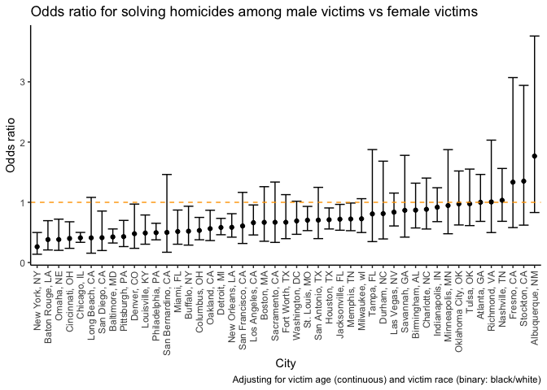

p8105_hw6_ay2543
================
Amy Yeung

# Problem 2

The Washington Post has gathered data on homicides in 50 large U.S.
cities and made the data available through a GitHub repository here. You
can read their accompanying article here.

``` r
# Load data
homicide = read_csv("homicide-data.csv")
```

    ## Rows: 52179 Columns: 12
    ## ── Column specification ────────────────────────────────────────────────────────
    ## Delimiter: ","
    ## chr (9): uid, victim_last, victim_first, victim_race, victim_age, victim_sex...
    ## dbl (3): reported_date, lat, lon
    ## 
    ## ℹ Use `spec()` to retrieve the full column specification for this data.
    ## ℹ Specify the column types or set `show_col_types = FALSE` to quiet this message.

``` r
# Clean data
homicide = homicide %>% 
  mutate(
    city_state = str_c(city, ", ", state),
    solved = ifelse(disposition == "Closed by arrest", 1, 0),
    victim_sex = ifelse(victim_sex == "Unknown", NA, victim_sex),
    victim_age = as.numeric(victim_age)
  ) %>% 
  filter(
    !city_state %in% c("Dallas, TX", "Phoenix, AZ", "Kansas City, MO", "Tulsa, AL") &
    victim_race %in% c("White", "Black")
  )
```

    ## Warning in mask$eval_all_mutate(quo): NAs introduced by coercion

Create a city_state variable (e.g. “Baltimore, MD”), and a binary
variable indicating whether the homicide is solved. Omit cities Dallas,
TX; Phoenix, AZ; and Kansas City, MO – these don’t report victim race.
Also omit Tulsa, AL – this is a data entry mistake. For this problem,
limit your analysis those for whom victim_race is white or black. Be
sure that victim_age is numeric.

For the city of Baltimore, MD, use the glm function to fit a logistic
regression with resolved vs unresolved as the outcome and victim age,
sex and race as predictors. Save the output of glm as an R object; apply
the broom::tidy to this object; and obtain the estimate and confidence
interval of the adjusted odds ratio for solving homicides comparing male
victims to female victims keeping all other variables fixed.

``` r
# Fit logistic regression model for Baltimore, MD only
fit_baltimore = homicide %>% 
  filter(city_state == "Baltimore, MD") %>% 
  glm(solved ~ victim_age + victim_sex + victim_race, data = ., family = binomial())

baltimore_odds = fit_baltimore %>% 
  broom::tidy() %>% 
  mutate(OR = exp(estimate)) %>%
  select(term, log_OR = estimate, OR, p.value) %>% 
  mutate(ci.low = exp(confint(fit_baltimore))[,1],
         ci.high = exp(confint(fit_baltimore))[,2]) 
```

    ## Waiting for profiling to be done...
    ## Waiting for profiling to be done...

``` r
baltimore_odds
```

    ## # A tibble: 4 × 6
    ##   term               log_OR    OR  p.value ci.low ci.high
    ##   <chr>               <dbl> <dbl>    <dbl>  <dbl>   <dbl>
    ## 1 (Intercept)       0.310   1.36  7.04e- 2  0.976   1.91 
    ## 2 victim_age       -0.00673 0.993 4.30e- 2  0.987   1.00 
    ## 3 victim_sexMale   -0.854   0.426 6.26e-10  0.324   0.558
    ## 4 victim_raceWhite  0.842   2.32  1.45e- 6  1.65    3.28

``` r
baltimore_odds %>% 
  filter(term == "victim_sexMale") %>% 
  select(term, OR, ci.low, ci.high) %>% 
  knitr::kable(digits = 3)
```

| term           |    OR | ci.low | ci.high |
|:---------------|------:|-------:|--------:|
| victim_sexMale | 0.426 |  0.324 |   0.558 |

The adjusted odds ratio for solving homicides comparing male victims to
female victims holding age and race fixed is **0.426 (0.324, 0.558)**.

Now run glm for each of the cities in your dataset, and extract the
adjusted odds ratio (and CI) for solving homicides comparing male
victims to female victims. Do this within a “tidy” pipeline, making use
of purrr::map, list columns, and unnest as necessary to create a
dataframe with estimated ORs and CIs for each city.

``` r
city_odds = homicide %>% 
  nest(data = -city_state) %>% 
  mutate(
  glm = purrr::map(.x = data, ~glm(solved ~ victim_age + victim_sex + victim_race, data = .x, family = binomial())),
  glm_tidy = purrr::map(glm, broom::tidy)
  ) %>% 
  unnest(cols = glm_tidy) %>% 
  filter(term == "victim_sexMale") %>% 
  mutate(
      OR = exp(estimate),
      ci.low = exp(estimate - 1.96*std.error),
      ci.high = exp(estimate + 1.96*std.error)
    ) %>% 
  select(city_state, OR, ci.low, ci.high)
  

city_odds %>% knitr::kable(digits = 3)
```

| city_state         |    OR | ci.low | ci.high |
|:-------------------|------:|-------:|--------:|
| Albuquerque, NM    | 1.767 |  0.831 |   3.761 |
| Atlanta, GA        | 1.000 |  0.684 |   1.463 |
| Baltimore, MD      | 0.426 |  0.325 |   0.558 |
| Baton Rouge, LA    | 0.381 |  0.209 |   0.695 |
| Birmingham, AL     | 0.870 |  0.574 |   1.318 |
| Boston, MA         | 0.667 |  0.354 |   1.260 |
| Buffalo, NY        | 0.521 |  0.290 |   0.935 |
| Charlotte, NC      | 0.884 |  0.557 |   1.403 |
| Chicago, IL        | 0.410 |  0.336 |   0.501 |
| Cincinnati, OH     | 0.400 |  0.236 |   0.677 |
| Columbus, OH       | 0.532 |  0.378 |   0.750 |
| Denver, CO         | 0.479 |  0.236 |   0.971 |
| Detroit, MI        | 0.582 |  0.462 |   0.734 |
| Durham, NC         | 0.812 |  0.392 |   1.683 |
| Fort Worth, TX     | 0.669 |  0.397 |   1.127 |
| Fresno, CA         | 1.335 |  0.580 |   3.071 |
| Houston, TX        | 0.711 |  0.558 |   0.907 |
| Indianapolis, IN   | 0.919 |  0.679 |   1.242 |
| Jacksonville, FL   | 0.720 |  0.537 |   0.966 |
| Las Vegas, NV      | 0.837 |  0.608 |   1.154 |
| Long Beach, CA     | 0.410 |  0.156 |   1.082 |
| Los Angeles, CA    | 0.662 |  0.458 |   0.956 |
| Louisville, KY     | 0.491 |  0.305 |   0.790 |
| Memphis, TN        | 0.723 |  0.529 |   0.988 |
| Miami, FL          | 0.515 |  0.304 |   0.872 |
| Milwaukee, wI      | 0.727 |  0.499 |   1.060 |
| Minneapolis, MN    | 0.947 |  0.478 |   1.875 |
| Nashville, TN      | 1.034 |  0.685 |   1.562 |
| New Orleans, LA    | 0.585 |  0.422 |   0.811 |
| New York, NY       | 0.262 |  0.138 |   0.499 |
| Oakland, CA        | 0.563 |  0.365 |   0.868 |
| Oklahoma City, OK  | 0.974 |  0.624 |   1.520 |
| Omaha, NE          | 0.382 |  0.203 |   0.721 |
| Philadelphia, PA   | 0.496 |  0.378 |   0.652 |
| Pittsburgh, PA     | 0.431 |  0.265 |   0.700 |
| Richmond, VA       | 1.006 |  0.498 |   2.033 |
| San Antonio, TX    | 0.705 |  0.398 |   1.249 |
| Sacramento, CA     | 0.669 |  0.335 |   1.337 |
| Savannah, GA       | 0.867 |  0.422 |   1.780 |
| San Bernardino, CA | 0.500 |  0.171 |   1.462 |
| San Diego, CA      | 0.413 |  0.200 |   0.855 |
| San Francisco, CA  | 0.608 |  0.317 |   1.165 |
| St. Louis, MO      | 0.703 |  0.530 |   0.932 |
| Stockton, CA       | 1.352 |  0.621 |   2.942 |
| Tampa, FL          | 0.808 |  0.348 |   1.876 |
| Tulsa, OK          | 0.976 |  0.614 |   1.552 |
| Washington, DC     | 0.691 |  0.469 |   1.018 |

Create a plot that shows the estimated ORs and CIs for each city.
Organize cities according to estimated OR, and comment on the plot.

``` r
city_odds %>% 
  mutate(
   city_state = fct_reorder(city_state, OR) 
  ) %>% 
  ggplot() +
  geom_point(aes(x = city_state, y = OR)) +
  geom_errorbar(aes(x = city_state, ymin = ci.low, ymax = ci.high)) +
  geom_hline(aes(yintercept = 1), color = "orange", lty = "dashed") +
  theme_classic() +
  labs(
    x = "City",
    y = "Odds ratio",
    title = "Odds ratio for solving homicides among male victims vs female victims",
    caption = "Adjusting for victim age (continuous) and victim race (binary: black/white)"
  ) + 
  theme(axis.text.x = element_text(angle = 90, hjust = 1, vjust = 0.5))
```

<!-- -->

-   New York, NY has the lowest odds ratio of solving homicides for male
    victims compared to female victims, holding victim age and victim
    race constant.

-   Albuquerque, NM has the highest odds ratio of solving homicides for
    male victims compared to female victims, holding victim age and
    victim race constant.

-   From the plot, we can see that most cities have an odds ratio less
    than 1, meaning that the odds of solving homicides for male victims
    is lower than the odds of solving homicides for female victims for
    most cities, holding victim age and victim race constant.

-   Cities with higher odds ratios for solving homicides for male
    victims compared to female victims tend to have wider 95% confidence
    intervals

-   Only Nashville, TN, Fresno, CA, Stockton, CA and Albuquerque, NM
    have higher odds of solving homicides for male victims than female
    victims, holding victim age and race constant.

    -   However, it is important to note that these odds ratios are not
        significant due to the wide range of 95% CI encompassing the
        null value.

# Problem 3

In this problem, you will analyze data gathered to understand the
effects of several variables on a child’s birthweight. This dataset,
available here, consists of roughly 4000 children and includes the
following variables:

babysex: baby’s sex (male = 1, female = 2) bhead: baby’s head
circumference at birth (centimeters) blength: baby’s length at birth
(centimeteres) bwt: baby’s birth weight (grams) delwt: mother’s weight
at delivery (pounds) fincome: family monthly income (in hundreds,
rounded) frace: father’s race (1 = White, 2 = Black, 3 = Asian, 4 =
Puerto Rican, 8 = Other, 9 = Unknown) gaweeks: gestational age in weeks
malform: presence of malformations that could affect weight (0 = absent,
1 = present) menarche: mother’s age at menarche (years) mheigth:
mother’s height (inches) momage: mother’s age at delivery (years) mrace:
mother’s race (1 = White, 2 = Black, 3 = Asian, 4 = Puerto Rican, 8 =
Other) parity: number of live births prior to this pregnancy pnumlbw:
previous number of low birth weight babies pnumgsa: number of prior
small for gestational age babies ppbmi: mother’s pre-pregnancy BMI ppwt:
mother’s pre-pregnancy weight (pounds) smoken: average number of
cigarettes smoked per day during pregnancy wtgain: mother’s weight gain
during pregnancy (pounds) Load and clean the data for regression
analysis (i.e. convert numeric to factor where appropriate, check for
missing data, etc.).

Propose a regression model for birthweight. This model may be based on a
hypothesized structure for the factors that underly birthweight, on a
data-driven model-building process, or a combination of the two.
Describe your modeling process and show a plot of model residuals
against fitted values – use add_predictions and add_residuals in making
this plot.

``` r
bwt = read_csv("birthweight.csv")
```

    ## Rows: 4342 Columns: 20
    ## ── Column specification ────────────────────────────────────────────────────────
    ## Delimiter: ","
    ## dbl (20): babysex, bhead, blength, bwt, delwt, fincome, frace, gaweeks, malf...
    ## 
    ## ℹ Use `spec()` to retrieve the full column specification for this data.
    ## ℹ Specify the column types or set `show_col_types = FALSE` to quiet this message.

``` r
bwt = bwt %>% 
  mutate(
    babysex = factor(babysex),
    frace = factor(frace),
    malform = factor(malform),
    mrace = factor(mrace)
  )

sum(is.na(bwt))
```

    ## [1] 0

Compare your model to two others:

One using length at birth and gestational age as predictors (main
effects only) One using head circumference, length, sex, and all
interactions (including the three-way interaction) between these Make
this comparison in terms of the cross-validated prediction error; use
crossv_mc and functions in purrr as appropriate.

Note that although we expect your model to be reasonable, model building
itself is not a main idea of the course and we don’t necessarily expect
your model to be “optimal”.
